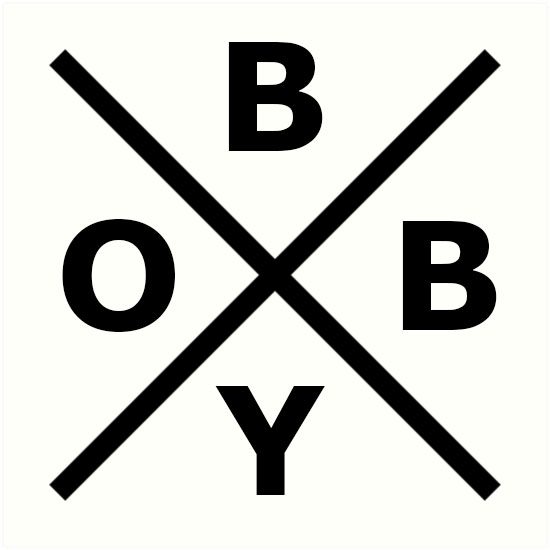

<h1 align="center">
  <br>
  
  <br>
  CWF THEME GENERATOR
  <br>
</h1>

<h5 align="center">Generates a starter kit theme based on Build Your Own Bootstrap principle,<br> with best practices we at Circle Web Foundry use on our projects.</h5>

<p align="center"> 
<a href="https://badge.fury.io/js/generator-cwf-theme"></a>
</p>

<p align="center">
  <a href="#installation">Installation</a> •
  <a href="#config">Configuration</a> •
  <a href="#scripts">NPM scripts</a> •
  <a href="#theme">Drupal Theme</a> •
  <a href="#license">License</a>
</p>


<h2 id="installation">Installation</h2>

First, install [Yeoman](http://yeoman.io) and generator-cwf-theme using [npm](https://www.npmjs.com/) (we assume you have pre-installed [node.js](https://nodejs.org/)).

```bash
npm install -g yo
npm install -g generator-cwf-theme
```

Then generate your new project:

```bash
# You need to create folder first, and then inside it run:
yo cwf-theme
```
<h2 id="config">Configuration</h2>
<p>The generator will ask you a bunch of questions to get you up and running. Most of these are self-explanatory, but some maybe not so much.🤔</p>
<ul>
  <!-- <li>Name your theme?</li>
  <li>What's your theme machine name?</li>
  <li>What proxy should broweserync use? - this is to connect Browsersync to your local enviorment</li>
  <li>Copy Bootstrap SCSS to theme? - Since we build our own Bootstrap and you should too, you can select which BS SCSS files should be copied to your theme.</li>
  <li>Copy Bootstrap JS to theme? - To copy BS JS files to the theme or not, you can use a CDN</li>
  <li>Add our awesome mixins to Bootstrap? - Add a few mixins we think are usefull</li>
  <li>We like and use the slick slider, would you like to add it? - Gives you a free beer, nah - adds slick slider to the theme</li> -->
  <li>Would you like to create your own Icon Font<br> - Creates a npm script so you can generate your own Icon Font, set with all SCSS mixins.</li>
  <li>Would you like to use Svg sprites?<br> - Creates a SVG sprite that is included in the theme and can easily be used in Twig templates. </li>
</ul>
<p>🤘🤘🤘 Be patient, it does a lot of work for you, copies the Bootstrap files to the theme, enables all needed libraries, generates npm build scripts, creates an icon font and/or icon sprite, generates a basic HTML test page for Bootstrap elements...</p>
<h2 id="scripts">NPM scripts</h2>

<p>The generator will build a set of npm scripts. <br>
To run each command type <code>npm run "COMMAND_NAME"</code>, here's a list of commands:</p>

Command| Does...
:-----:|:-----:
`scss-lint:fix`|Lints the SCSS files following the rules set in the <code>.stylelintrc</code> file and if can fixes errors and warnings
`lint:js`| Lints the JS files using the rules in <code>.eslintrc.json</code> following the Drupal standards.
`lint:fix`| Tries to automatically fix linted JS errors and warnings.
`image:min`| Minifies images in the src/images directory and moves them to the <code>/dist/images</code> folder.
`css:scss-lint`| Lints the SCSS files following the rules set in the <code>.stylelintrc</code> file.
`css:scss`| Compiles all SCSS files from <code>src/scss</code> to <code>dist/scss</code>.
`css:prefix`| Autoprefixes files following settings from the <code>.browserslistrc</code> file.
`serve`| Start a new server with the <code>url</code> you entered and watches for CSS & JS file changes in the dist folder.
`image:icons`| Generates an icon font from all the SVG files in the <code>scr/images/icons</code> folder.
`watch:icons`| Watches the <code>scr/images/icons</code> folder for changes
`image:sprite`| Compress separate SVG files from <code>scr/images/svg</code> and combines them into one SVG "sprite".
`watch:svg`| Watches the <code>scr/images/svg</code> folder for changes.
`build:images`| Runs all image related scripts: icons, sprites and image minifications.
`build:js`| Minifies the main JS file.
`build:css`| Runs all SCSS and CSS related scripts.
`build`| Runs all build scripts.
`watch:css`| Watches SCSS files for changes and runs all related scripts.
`watch:images`| Watches all image files for changes and ... runs all related scripts.
`watch`| WATCHES ALL FILES AND RUNS APPROPRIATE SCRIPTS

<p>TL;DR <code>npm run build</code> and <code>npm run watch</code> is all you need.</p>

<h2 id="theme">Drupal theme</h2>

<p>From the generator a new Drupal base theme will emerge.</p>
<p>You should immediately go to the theme settings page and check out what's there.</p>


## License

Apache-2.0 © [Ivan Buisic]()


[npm-image]: https://badge.fury.io/js/generator-cwf-theme.svg
[npm-url]: https://npmjs.org/package/generator-cwf-theme
[travis-image]: https://travis-ci.org/ibuisic/generator-cwf-theme.svg?branch=master
[travis-url]: https://travis-ci.org/ibuisic/generator-cwf-theme
[daviddm-image]: https://david-dm.org/ibuisic/generator-cwf-theme.svg?theme=shields.io
[daviddm-url]: https://david-dm.org/ibuisic/generator-cwf-theme
